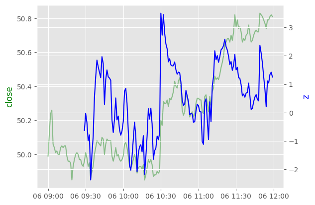

# Takumi

## Machine Learning
- __Features__: Derived from historical prices, technical indicators
- __Target__: z-score of price `lookahead` time periods later

Didn't worked well in initial experiments as performance is not much better than random guessing / baseline.

## Mean Reversion
__Idea__

Z-score usually spike/drop significantly around 1030 ET, around the time of report release. Has the tendency to revert back to mean.

__Strategy 1__  
Entry:  
- Wednesday
- Time between 1025 and 1035 AND z-score is below / above threshold, go long / short.  

Exit:   
- Z-score breaks 0
- Fast sma cross below / above slow sma, close opened position.
- If position is still opened at 1159, close position.

Tested 2020 - 2023

Parameters
| Parameter           | Value |
|---------------------|-------|
| z-score window      | 30    |
| fast sma            | 5     |
| slow sma            | 15    |
| long entry z-score  | -3.0  |
| short entry z-score | 2.0   |
| long exit z-score   | 0.0   |
| short exit z-score  | 0.0   |

Results
| Metric                 | Value |
|------------------------|-------|
| Total Return [%]       | 17.86 |
| Total Trades           | 80    |
| Win Rate [%]           | 67.5  |
| Avg Winning Trade [%]  | 0.479 |
| Avg Losing Trade [%]   | -0.37 |
| Sharpe Ratio           | 11.84 |
| Annualized Returns [%] | 4.56  |

| datetime | Return [%] |
|:---------|-------:|
| 2020     | 4.9871 |
| 2021     | 2.5626 |
| 2022     | 8.15   |
| 2023     | 1.2094 |

__Strategy 2__  
Entry:  
- Wednesday
- Time between 1025 and 1035 AND z-score is below / above threshold, go long / short.  

Exit:
- First 60 minutes after opening position, if z-score breaks 0 and price direction flip (based on sma crossover), close position.
- After 60 minutes, close position if return is +5% or -0.5%
- Position can be held until Friday 1559, if position is still opened by that time, close position.

Tested on 2020 - 2023

Parameters
| Parameter           | Value |
|---------------------|-------|
| z-score window      | 30    |
| fast sma            | 5     |
| slow sma            | 15    |
| long entry z-score  | -3.0  |
| short entry z-score | 2.0   |
| long exit z-score   | 0.0   |
| short exit z-score  | 0.0   |
| initial time        | 60 min|

Results
| Metric                 | Value  |
|------------------------|--------|
| Total Return [%]       | 24.75  |
| Total Trades           | 80     |
| Win Rate [%]           | 63.75  |
| Avg Winning Trade [%]  | 0.734  |
| Avg Losing Trade [%]   | -0.533 |
| Sharpe Ratio           | 4.25   |
| Annualized Returns [%] | 6.38   |

| datetime | Return [%] |
|:---------|-------:|
| 2020     | 9.6372 |
| 2021     | 0.9414 |
| 2022     | 6.5452 |
| 2023     | 5.8035 |