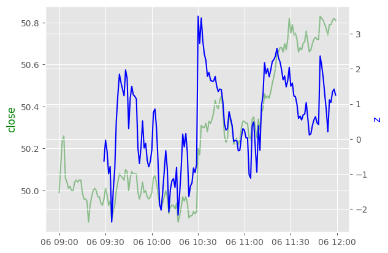

## Machine Learning
- __Features__: Derived from historical prices, technical indicators
- __Target__: z-score of price `lookahead` time periods later

Didn't worked well in initial experiments as performance is not much better than random guessing / baseline.

## Metrics
### Compound Annual Growth Rate (CAGR)

The Compound Annual Growth Rate (CAGR) is a measure of the annual growth rate of an investment over a specified time period. It is calculated using the following formula:

CAGR = (Ending Value / Beginning Value)^(1/n) - 1

Where:
- Ending Value is the ending value of the investment.
- Beginning Value is the initial value of the investment.
- n is the number of years.

To calculate the CAGR, subtract 1 from the result obtained from raising the ratio of the ending value to the beginning value to the power of the reciprocal of the number of years, and then multiply by 100 to express the result as a percentage.

## Mean Reversion
__Idea__  
  
Z-score usually spike/drop significantly around 1030 ET, around the time of report release. Has the tendency to revert back to mean.

### __Strategy 1__  
Entry:  
- Wednesday
- Time between 1025 and 1035 AND z-score is below / above threshold, go long / short.  

Exit:   
- Z-score breaks 0
- Fast sma cross below / above slow sma, close opened position.
- If position is still opened at 1159, close position.

Tested 2020 - 2023

<table>
<tr><th> Parameters </th><th>Results</th><th>Yearly</th></tr>
<tr><td>

| Parameter           | Value |
|---------------------|-------|
| z-score window      | 30    |
| fast sma            | 5     |
| slow sma            | 15    |
| long entry z-score  | -3.0  |
| short entry z-score | 2.0   |
| long exit z-score   | 0.0   |
| short exit z-score  | 0.0   |

</td><td>

| Metric                 | Value |
|------------------------|-------|
| Total Return [%]       | 17.86 |
| Total Trades           | 80    |
| Win Rate [%]           | 67.5  |
| Avg Winning Trade [%]  | 0.479 |
| Avg Losing Trade [%]   | -0.37 |
| Sharpe Ratio           | 11.84 |
| Annualized Returns [%] | 4.56  |

</td><td>  

| datetime | Return [%] |
|:---------|-------:|
| 2020     | 4.9871 |
| 2021     | 2.5626 |
| 2022     | 8.15   |
| 2023     | 1.2094 |

</td></tr> </table>

### __Strategy 2__  
Entry:  
- Wednesday
- Time between 1025 and 1035 AND z-score is below / above threshold, go long / short.  

Exit:
- First 60 minutes after opening position, if z-score breaks 0 and price direction flip (based on sma crossover), close position.
- After 60 minutes, close position if return is +5% or -0.5%
- Position can be held until Friday 1559, if position is still opened by that time, close position.

Tested on 2020 - 2023

<table>
<tr><th> Parameters </th><th>Results</th><th>Yearly</th></tr>
<tr><td>

| Parameter           | Value |
|---------------------|-------|
| z-score window      | 30    |
| fast sma            | 5     |
| slow sma            | 15    |
| long entry z-score  | -3.0  |
| short entry z-score | 2.0   |
| long exit z-score   | 0.0   |
| short exit z-score  | 0.0   |
| initial time        | 60 min|

</td><td>

| Metric                 | Value  |
|------------------------|--------|
| Total Return [%]       | 24.75  |
| Total Trades           | 80     |
| Win Rate [%]           | 63.75  |
| Avg Winning Trade [%]  | 0.734  |
| Avg Losing Trade [%]   | -0.533 |
| Sharpe Ratio           | 4.25   |
| Annualized Returns [%] | 6.38   |

</td><td>  

| datetime | Return [%] |
|:---------|-------:|
| 2020     | 9.6372 |
| 2021     | 0.9414 |
| 2022     | 6.5452 |
| 2023     | 5.8035 |

</td></tr> </table>

### __Strategy 3 (Cheat)__  
Entry:  
- On Wednesday, between 1025 and 1035, find max / min z-score and go short / long accordingly.  

Exit:  
- Search for peak / bottom price after opening position and close.

Tested on 2020 - 2023

<table>
<tr><th> Parameters </th><th>Results</th><th>Yearly</th></tr>
<tr><td>

| Parameter           | Value |
|---------------------|-------|
| z-score window      | 30    |
| long entry z-score  | -3.0  |
| short entry z-score | 2.0   |

</td><td>

| Metric                 | Value  |
|------------------------|--------|
| Total Return [%]       | 106.52 |
| Total Trades           | 79     |
| Win Rate [%]           | 97.47  |
| Avg Winning Trade [%]  | 0.95   |
| Avg Losing Trade [%]   | -0.037 |
| Sharpe Ratio           | 34.32  |
| Annualized Returns [%] | 30.42  |

</td><td>  

| datetime | Return [%] |
|:---------|-------:|
| 2020     | 28.63  |
| 2021     | 17.85  |
| 2022     | 20.26  |
| 2023     | 13.28  |

</td></tr> </table>