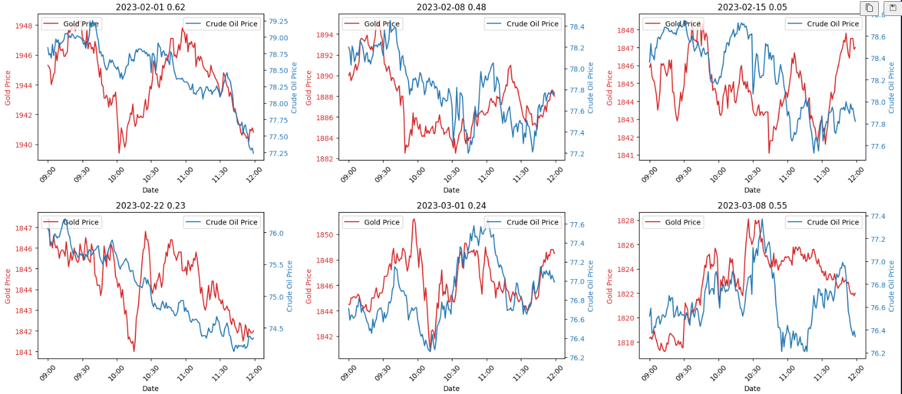

# Pairs Trading

## Idea  
- Theoretically, ratio between oil and gold price should be constant over time.
- Visually, it is shown that when price of oil and gold diverges they will revert.

## __Strategy 1 (cheat)__
Entry:  
- Compute spread between CL and GC  (CL - hedge_ratio * GC).
- Compute z-score. Parameters of z-score (mean, std) are computed using spread on Monday and Tuesday.
- If z-score of spread <-2.0, short CL long GC, vice versa  

Exit:  
- Exit at the time when z-score is closest to 0.   

<table>
<tr><th> Ends at 1159 </th><th> Ends at 1559 </th></tr>
<tr><td>  

|                            | WTI Crude                 | Gold                      |
|:---------------------------|:--------------------------|:--------------------------|
| Start                      | 2020-01-08 09:00:00-05:00 | 2020-01-08 09:00:00-05:00 |
| End                        | 2023-12-27 11:59:00-05:00 | 2023-12-27 11:59:00-05:00 |
| Period                     | 26 days 00:00:00          | 26 days 00:00:00          |
| Start Value                | 100.0                     | 100.0                     |
| End Value                  | 103.808                   | 199.153                   |
| Total Return [%]           | 3.808                     | 99.153                    |
| Benchmark Return [%]       | 20.349                    | 32.653                    |
| Max Gross Exposure [%]     | 106.055                   | 100.032                   |
| Total Fees Paid            | 0.0                       | 0.0                       |
| Max Drawdown [%]           | 12.632                    | 0.776                     |
| Max Drawdown Duration      | 12 days 22:49:00          | 0 days 20:37:00           |
| Total Trades               | 167                       | 167                       |
| Total Closed Trades        | 167                       | 167                       |
| Total Open Trades          | 0                         | 0                         |
| Open Trade PnL             | 0.0                       | 0.0                       |
| Win Rate [%]               | 46.707                    | 90.419                    |
| Best Trade [%]             | 18.195                    | 1.352                     |
| Worst Trade [%]            | -4.083                    | -0.512                    |
| Avg Winning Trade [%]      | 0.999                     | 0.469                     |
| Avg Losing Trade [%]       | -0.816                    | -0.111                    |
| Avg Winning Trade Duration | 0 days 01:01:40           | 0 days 01:02:46.887417218 |
| Avg Losing Trade Duration  | 0 days 01:00:47.045454545 | 0 days 00:41:08           |
| Profit Factor              | 1.05                      | 45.665                    |
| Expectancy                 | 0.018                     | 0.593                     |
| Sharpe Ratio               | 1.249                     | 57.691                    |

</td><td>

|                            | WTI Crude                 | Gold                      |
|:---------------------------|:--------------------------|:--------------------------|
| Start                      | 2020-01-08 09:00:00-05:00 | 2020-01-08 09:00:00-05:00 |
| End                        | 2023-12-27 15:59:00-05:00 | 2023-12-27 15:59:00-05:00 |
| Period                     | 60 days 16:00:00          | 60 days 16:00:00          |
| Start Value                | 100.0                     | 100.0                     |
| End Value                  | 118.209                   | 221.481                   |
| Total Return [%]           | 18.209                    | 121.481                   |
| Benchmark Return [%]       | 19.444                    | 32.457                    |
| Max Gross Exposure [%]     | 106.962                   | 100.029                   |
| Total Fees Paid            | 0.0                       | 0.0                       |
| Max Drawdown [%]           | 15.466                    | 1.275                     |
| Max Drawdown Duration      | 19 days 09:46:00          | 2 days 12:18:00           |
| Total Trades               | 157                       | 157                       |
| Total Closed Trades        | 157                       | 157                       |
| Total Open Trades          | 0                         | 0                         |
| Open Trade PnL             | 0.0                       | 0.0                       |
| Win Rate [%]               | 48.408                    | 93.631                    |
| Best Trade [%]             | 18.195                    | 1.392                     |
| Worst Trade [%]            | -4.412                    | -0.277                    |
| Avg Winning Trade [%]      | 1.283                     | 0.551                     |
| Avg Losing Trade [%]       | -0.985                    | -0.115                    |
| Avg Winning Trade Duration | 0 days 02:25:31.578947368 | 0 days 02:26:17.959183673 |
| Avg Losing Trade Duration  | 0 days 02:29:38.734177215 | 0 days 02:31:18           |
| Profit Factor              | 1.205                     | 64.628                    |
| Expectancy                 | 0.102                     | 0.774                     |
| Sharpe Ratio               | 2.306                     | 34.627                    |

</td></tr> </table>

Notes:  
- Noticed that trades close within an hour, not enough time for spread to revert?
- Apparently not, positions are usually opened between 0900 and 1000.  
- Oil trades do no profit, price is not going the right direction when spread reverts?
- Win rate of oil trades is <50% 

## __Strategy 2__  
Entry:  
- Compute spread between CL and GC  (CL - hedge_ratio * GC).
- Compute z-score. Parameters of z-score (mean, std) are computed using spread on Monday and Tuesday.
- If z-score of spread <-2.0, short CL long GC, vice versa    

Exit:  
- Exit when z-score breaks 0
- OR if time is 1659  

|                            | WTI Crude                 | Gold                      |
|:---------------------------|:--------------------------|:--------------------------|
| Start                      | 2020-01-08 09:00:00-05:00 | 2020-01-08 09:00:00-05:00 |
| End                        | 2023-12-27 15:59:00-05:00 | 2023-12-27 15:59:00-05:00 |
| Period                     | 60 days 16:00:00          | 60 days 16:00:00          |
| Start Value                | 100.0                     | 100.0                     |
| End Value                  | 81.717                    | 103.261                   |
| Total Return [%]           | -18.283                   | 3.261                     |
| Benchmark Return [%]       | 19.444                    | 32.457                    |
| Max Gross Exposure [%]     | 146.823                   | 103.424                   |
| Total Fees Paid            | 0.0                       | 0.0                       |
| Max Drawdown [%]           | 35.311                    | 8.499                     |
| Max Drawdown Duration      | 56 days 05:14:00          | 44 days 21:03:00          |
| Total Trades               | 157                       | 157                       |
| Total Closed Trades        | 157                       | 157                       |
| Total Open Trades          | 0                         | 0                         |
| Open Trade PnL             | 0.0                       | 0.0                       |
| Win Rate [%]               | 42.038                    | 58.599                    |
| Best Trade [%]             | 35.341                    | 1.155                     |
| Worst Trade [%]            | -6.474                    | -1.994                    |
| Avg Winning Trade [%]      | 1.409                     | 0.333                     |
| Avg Losing Trade [%]       | -1.057                    | -0.418                    |
| Avg Winning Trade Duration | 0 days 02:24:51.818181818 | 0 days 02:08:52.826086956 |
| Avg Losing Trade Duration  | 0 days 02:14:27.333333333 | 0 days 02:33:36           |
| Profit Factor              | 0.807                     | 1.121                     |
| Expectancy                 | -0.123                    | 0.021                     |
| Sharpe Ratio               | -2.064                    | 1.281                     |
